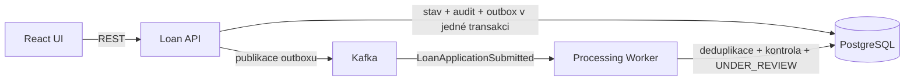

# DevBank · korporátní úvěry

[](https://github.com/matyzatka/devbank-loan-platform/actions/workflows/ci.yml)
[](backend/pom.xml)
[](frontend/package.json)
[](LICENSE)

DevBank je portfolio demonstrátor zpracování žádostí o korporátní úvěry. Odděluje REST API a asynchronní processing worker, používá PostgreSQL, transactional outbox, Kafka, idempotentní zpracování a auditní stopu. Operátorské UI je v češtině.

> **Demo prostředí:** systém používá výhradně fiktivní data a neprovádí skutečný úvěrový scoring.

## Spuštění z čistého checkoutu

Jediným požadavkem je běžící Docker Desktop s Docker Compose. Lokální hodnoty lze volitelně změnit zkopírováním ukázkové konfigurace; žádný skutečný `.env` se do Gitu neukládá.

```powershell
git clone https://github.com/matyzatka/devbank-loan-platform.git
cd devbank-loan-platform
Copy-Item .env.example .env   # volitelné; Compose má bezpečné lokální výchozí hodnoty
docker compose up --build
```

Na Linuxu nebo macOS použijte místo `Copy-Item` příkaz `cp .env.example .env`.

Po dokončení healthchecků jsou dostupné:

- UI: http://localhost:3000/applications
- OpenAPI: http://localhost:8080/swagger-ui.html
- readiness: http://localhost:8080/actuator/health/readiness

Stack obsahuje pět služeb:

| Služba | Úloha | Lokální port |
|---|---|---:|
| `frontend` | React UI servírované přes Nginx | `3000` |
| `loan-api` | REST API, stav žádosti a outbox publisher | `8080` |
| `processing-worker` | Kafka consumer a předběžná kontrola | pouze interní |
| `postgres` | stav, outbox, audit a deduplikační záznamy | `5432` |
| `kafka` | doručení business událostí | `9092` |

Zastavení zachová databázová data:

```powershell
docker compose down
```

Úplný reset lokálních dat:

```powershell
docker compose down --volumes
```

## Automatizovaný smoke test

Smoke test sestaví a spustí celý stack, ověří frontend a readiness API, založí žádost přes REST a čeká na tok PostgreSQL → outbox → Kafka → worker → `UNDER_REVIEW`. Nakonec ověří auditní `requestId` a `eventId`.

```powershell
./scripts/smoke-test.ps1 -Build
```

Pro jednorázový CI běh včetně odstranění kontejnerů a volumes:

```powershell
./scripts/smoke-test.ps1 -Build -Cleanup
```

## Samostatný lokální vývoj

Nejprve lze spustit jen infrastrukturu:

```powershell
docker compose up -d postgres kafka
```

Backend API používá lokální profil, který jako jediný obsahuje `localhost` fallbacky:

```powershell
cd backend
$env:SPRING_PROFILES_ACTIVE="local"
$env:LOAN_PLATFORM_API_ENABLED="true"
$env:LOAN_PLATFORM_WORKER_ENABLED="false"
$env:LOAN_PLATFORM_OUTBOX_PUBLISHER_ENABLED="true"
mvn spring-boot:run
```

Worker se spouští jako druhý proces:

```powershell
cd backend
$env:SPRING_PROFILES_ACTIVE="local"
$env:SPRING_MAIN_WEB_APPLICATION_TYPE="none"
$env:LOAN_PLATFORM_API_ENABLED="false"
$env:LOAN_PLATFORM_WORKER_ENABLED="true"
$env:LOAN_PLATFORM_OUTBOX_PUBLISHER_ENABLED="false"
mvn spring-boot:run
```

Frontendový Vite proxy cíl lze změnit přes `VITE_BACKEND_URL`:

```powershell
cd frontend
$env:VITE_BACKEND_URL="http://localhost:8080"
npm ci
npm run dev
```

## Runtime konfigurace

Compose načítá volitelné hodnoty z `.env`; úplný bezpečný příklad je v [.env.example](.env.example). Pro budoucí kontejnerové prostředí jsou podstatné zejména:

- `SPRING_DATASOURCE_URL`, `SPRING_DATASOURCE_USERNAME`, `SPRING_DATASOURCE_PASSWORD`;
- `SPRING_KAFKA_BOOTSTRAP_SERVERS`, `SPRING_KAFKA_CONSUMER_GROUP_ID`;
- `KAFKA_TOPIC` a `SERVER_PORT`;
- `LOAN_PLATFORM_API_ENABLED`, `LOAN_PLATFORM_WORKER_ENABLED`, `LOAN_PLATFORM_OUTBOX_PUBLISHER_ENABLED`;
- `LOAN_PLATFORM_DEMO_DATA_ENABLED`;
- frontendový `BACKEND_URL` pro Nginx reverse proxy.

Hlavní konfigurace neobsahuje cloudové adresy ani credentials. `application-local.yml` izoluje lokální fallbacky a `application-prod.yml` zapíná strukturované logování, vypíná demo data a OpenAPI UI. Produkční secrets musí být dodány z runtime secret store; nejsou součástí image ani repozitáře.

## Kontroly kvality

```powershell
cd backend
mvn test
```

```powershell
cd frontend
npm ci
npm run lint
npm test
npm run build
```

CI provádí backendové a frontendové testy, sestaví oba Docker image a spustí plný lokální event-flow smoke test. Workflow neobsahuje AWS credentials, deploy ani publikování image.

## Architektura a spolehlivost



- workflow `SUBMITTED → UNDER_REVIEW → APPROVED | REJECTED`;
- Flyway reprodukovatelně inicializuje databázové schéma;
- HTTP commandy a Kafka consumer jsou idempotentní;
- optimistic locking chrání souběžné změny;
- logovací kontext obsahuje `requestId`, `applicationId` a `eventId` bez celých business payloadů;
- deterministický seeder je bezpečný při startu více instancí.

Podrobnosti jsou v [architektonické dokumentaci](docs/ARCHITECTURE.md) a v [produktovém briefu](brief.md).

## Stav přípravy na AWS

Repozitář zatím neobsahuje cloudový deployment a žádné AWS zdroje nevytváří. Aplikační kontejnery jsou připravené přijímat runtime konfiguraci vhodnou pro ECS/Fargate. Před reálným nasazením bude nutné samostatně navrhnout síť, image registry, databázi, Kafka-compatible službu, secret store, load balancer, logování, IAM a provozní limity.
