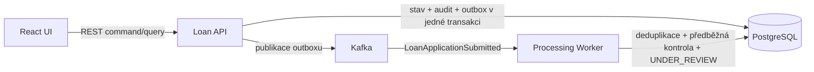

# DevBank · korporátní úvěry

[](https://github.com/matyzatka/devbank-loan-platform/actions/workflows/ci.yml)
[](backend/pom.xml)
[](frontend/package.json)
[](LICENSE)

DevBank je profesionální portfolio demonstrátor zpracování žádostí o korporátní úvěry. Ukazuje oddělené API a asynchronní processing worker, spolehlivé publikování business událostí, idempotenci, auditní stopu a české operátorské UI.

> **Demo prostředí:** systém používá výhradně fiktivní data a neprovádí skutečný úvěrový scoring.

## Co projekt prokazuje

- explicitní workflow `SUBMITTED → UNDER_REVIEW → APPROVED | REJECTED`;
- Loan API a Processing Worker jako samostatné procesy;
- PostgreSQL, Flyway a jOOQ;
- transactional outbox a Kafka doručení alespoň jednou;
- deduplikaci eventů a idempotentní HTTP commandy;
- optimistic locking a odmítnutí neplatných přechodů;
- audit s `requestId`, `applicationId`, `eventId` a důvodem zamítnutí;
- deterministická demo data bezpečná při startu více instancí;
- React, TypeScript, TanStack Query, React Hook Form a Zod;
- automatické backendové, frontendové a Docker kontroly v GitHub Actions.

## Architektura



API přijímá commandy a vlastní hlavní stav žádosti. Worker samostatně konzumuje `LoanApplicationSubmitted`, provádí předběžnou validační a procesní kontrolu a posouvá žádost do ručního posouzení. Podrobnosti a transakční hranice popisuje [architektonická dokumentace](docs/ARCHITECTURE.md).

## Rychlé spuštění

Požadavky: Docker Desktop a Docker Compose.

```powershell
docker compose up --build
```

Po startu jsou dostupné:

- UI: http://localhost:3000/applications
- OpenAPI: http://localhost:8080/swagger-ui.html
- readiness: http://localhost:8080/actuator/health/readiness

Zastavení lokálního stacku:

```powershell
docker compose down
```

## Vývojářské ověření

Backend:

```powershell
cd backend
mvn verify
```

Frontend:

```powershell
cd frontend
npm ci
npm run lint
npm test
npm run build
```

CI provádí stejné kontroly na GitHub-hosted runneru a navíc sestaví oba existující Docker images označené commit SHA. Image se nikam nepublikují.

## Struktura repozitáře

```text
backend/              Java 21, Spring Boot, doména, API, worker a migrace
frontend/             React a TypeScript operátorské UI
docs/                 architektonická dokumentace
infra/                poznámky k lokální infrastruktuře
.github/workflows/    CI pipeline
docker-compose.yml    kompletní lokální prostředí
brief.md              produktová a architektonická akceptační kritéria
```

## Dokumentace a omezení

- [Produktový a architektonický brief](brief.md)
- [Architektura a zpracování událostí](docs/ARCHITECTURE.md)
- [Lokální infrastruktura](infra/README.md)

Autentizace, skutečný scoring, cloudový deployment a AWS služby nejsou součástí aktuálního rozsahu. Projekt je dostupný pod [MIT licencí](LICENSE).
