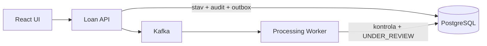

# DevBank · korporátní úvěry

[](https://github.com/matyzatka/devbank-loan-platform/actions/workflows/ci.yml)
[](backend/pom.xml)
[](frontend/package.json)
[](LICENSE)

DevBank zpracovává žádosti o korporátní úvěry od založení přes automatickou předběžnou kontrolu až po rozhodnutí specialisty. Loan API a Processing Worker běží jako samostatné procesy nad PostgreSQL a Kafkou; transactional outbox, idempotence, optimistic locking a auditní stopa chrání konzistenci celého toku.

> **Ukázkové prostředí:** systém používá výhradně fiktivní data a neprovádí úvěrový scoring.

## Technická rozhodnutí a důkazy

| Rozhodnutí | Provozní význam | Důkaz |
|---|---|---|
| **Skutečná procesní hranice** | Loan API přijímá commandy a publikuje outbox; Processing Worker samostatně konzumuje business události. Obě role lze nasazovat a škálovat nezávisle. | [Compose topologie](docker-compose.yml), [worker](backend/src/main/java/dev/bank/loanplatform/processing/LoanProcessingWorker.java) |
| **Atomická business transakce** | Stav žádosti, auditní historie a outbox event se uloží společně. Databázový commit nemůže předběhnout událost potřebnou pro další zpracování. | [aplikační služba](backend/src/main/java/dev/bank/loanplatform/application/LoanApplicationService.java), [repository test](backend/src/test/java/dev/bank/loanplatform/persistence/JooqLoanApplicationRepositoryTest.java) |
| **Transactional outbox připravený na více instancí** | Publisher zamyká dávku přes `FOR UPDATE SKIP LOCKED`, čeká na potvrzení brokeru a eviduje každý pokus. Selhání ponechá event k bezpečnému opakování. | [outbox repository](backend/src/main/java/dev/bank/loanplatform/persistence/JooqOutboxRepository.java), [failure test](backend/src/test/java/dev/bank/loanplatform/messaging/OutboxPublicationFailureTest.java) |
| **At-least-once bez dvojího business účinku** | Worker atomicky registruje `eventId`; opakované doručení stejné události stav podruhé nezmění. | [processed-event repository](backend/src/main/java/dev/bank/loanplatform/persistence/JooqProcessedEventRepository.java), [Kafka integrační test](backend/src/test/java/dev/bank/loanplatform/messaging/KafkaOutboxIntegrationTest.java) |
| **Řízené souběžné změny** | Explicitní stavový automat odmítá neplatné přechody a compare-and-set update chrání agregát před ztracenou aktualizací. | [doménový model](backend/src/main/java/dev/bank/loanplatform/domain/LoanApplication.java), [optimistic locking test](backend/src/test/java/dev/bank/loanplatform/persistence/JooqLoanApplicationRepositoryTest.java) |
| **Idempotentní HTTP commandy** | `Idempotency-Key` váže výsledek na hash požadavku: opakování vrací původní žádost, kolize s jiným obsahem končí konfliktem. | [idempotency repository](backend/src/main/java/dev/bank/loanplatform/persistence/JooqIdempotencyRepository.java), [API test](backend/src/test/java/dev/bank/loanplatform/api/LoanApplicationControllerTest.java) |
| **Kontrolované selhání zpráv** | Dočasná chyba spustí omezený retry; nezpracovatelná událost skončí v dead-letter topicu místo nekonečné retry smyčky. | [Kafka konfigurace](backend/src/main/java/dev/bank/loanplatform/configuration/KafkaConfiguration.java), [DLT test](backend/src/test/java/dev/bank/loanplatform/messaging/KafkaOutboxIntegrationTest.java) |
| **Audit a end-to-end korelace** | `requestId`, `applicationId` a `eventId` propojují HTTP, outbox, Kafka consumer i auditní historii bez logování celého citlivého payloadu. | [correlation filter](backend/src/main/java/dev/bank/loanplatform/api/CorrelationIdFilter.java), [strukturované logování](backend/src/main/resources/application-prod.yml) |
| **Provozní signály, ne pouze technické logy** | Readiness/liveness, graceful shutdown, počet čekajících eventů a stáří nejstaršího outbox záznamu poskytují měřitelné signály pro rollout a alerting. | [Actuator konfigurace](backend/src/main/resources/application.yml), [outbox metriky](backend/src/main/java/dev/bank/loanplatform/messaging/OutboxMetrics.java) |
| **Reprodukovatelnost od checkoutu po event flow** | Flyway verzovaně vytvoří schéma, multi-stage image běží pod neprivilegovaným uživatelem a CI ověří testy, oba image i celý asynchronní tok. | [migrace](backend/src/main/resources/db/migration), [backend image](backend/Dockerfile), [CI](.github/workflows/ci.yml), [smoke test](scripts/smoke-test.ps1) |



## Rychlý start

Požadavkem je pouze Docker Desktop s Docker Compose.

```powershell
git clone https://github.com/matyzatka/devbank-loan-platform.git
cd devbank-loan-platform
docker compose up --build
```

Po dokončení health checků:

- UI: http://localhost:3000/applications
- OpenAPI: http://localhost:8080/swagger-ui.html
- readiness: http://localhost:8080/actuator/health/readiness

Kompletní automatizovaný smoke test:

```powershell
./scripts/smoke-test.ps1 -Build -Cleanup
```

## Dokumentace

[Dokumentační rozcestník](docs/README.md) odděluje produktový kontext, aplikační architekturu, lokální provoz a návrh AWS nasazení. Cloudová část popisuje budoucí stav; repozitář neprovádí žádné AWS operace ani deployment.
