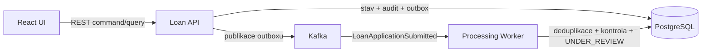

# Aplikační architektura

## Procesní hranice

Backendový image se spouští ve dvou nezávislých rolích:

- `loan-api` obsluhuje REST API, vlastní hlavní stav žádosti a publikuje události z outboxu;
- `processing-worker` konzumuje `LoanApplicationSubmitted`, provádí předběžnou validační a procesní kontrolu a posouvá žádost do `UNDER_REVIEW`.

Role sdílejí PostgreSQL a doménový model, ale mají samostatný lifecycle a škálování. API nekonzumuje vlastní událost; asynchronní hranice odděluje přijetí žádosti od následného zpracování.

## Konzistence

- Založení žádosti používá `Idempotency-Key`. Stejný klíč a payload vrátí původní výsledek; jiný payload skončí konfliktem.
- Stav žádosti, auditní záznam a outbox event vznikají v jedné databázové transakci.
- Outbox publisher označí event jako publikovaný až po potvrzení brokerem; nedokončený pokus zůstává dostupný pro opakování.
- Kafka poskytuje doručení alespoň jednou. Worker atomicky registruje `eventId` v tabulce `processed_event`, takže opakované doručení nezmění stav podruhé.
- Stavové přechody používají optimistic locking a odmítají změnu nad zastaralou verzí agregátu.

Řešení garantuje idempotentní business výsledek, nikoli právě jedno fyzické doručení zprávy.

## Audit a observabilita

Historie uchovává původní a nový stav, verzi, čas, aktéra, `requestId`, `eventId` a případný důvod zamítnutí. Stejné identifikátory vstupují do MDC a propojují HTTP požadavek, databázovou změnu a asynchronní zpracování bez logování celého business payloadu.

Actuator poskytuje liveness a readiness endpointy. Metrika `loan.outbox.pending` zpřístupňuje počet nepublikovaných eventů; Kafka a jOOQ logy jsou v běžném provozu omezené na `WARN`.

## Databázové schéma a referenční data

Flyway spravuje schéma pomocí verzovaných migrací. Lokální referenční data jsou deterministická: PostgreSQL advisory lock serializuje souběžné starty, stabilní UUID a `ON CONFLICT DO NOTHING` zajišťují opakovatelnost. Produkční profil inicializaci referenčních dat vypíná.

## Ověřované scénáře

Automatizované testy pokrývají duplicitní HTTP požadavek, duplicitní Kafka event, neplatný stavový přechod, optimistic locking konflikt, selhání před potvrzením publikace a souběžný start více inicializačních procesů. Celý tok REST → PostgreSQL → outbox → Kafka → worker → `UNDER_REVIEW` ověřuje samostatný smoke test.
