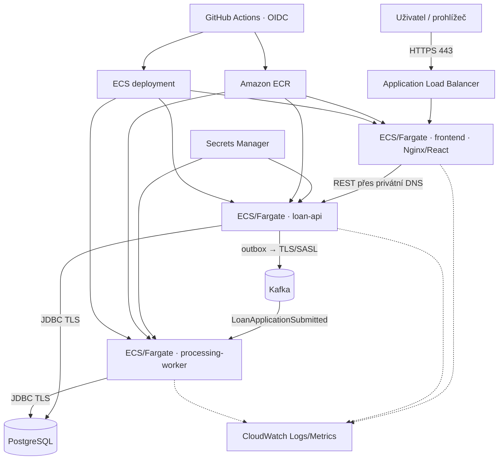

# Návrh AWS architektury

Dokument popisuje cílovou AWS architekturu. Aktuální repozitář obsahuje lokální běhové prostředí; cloudová infrastruktura bude implementována jako samostatná navazující vrstva.

## Výchozí stav aplikace

Návrh vychází z existujících image a rolí v repozitáři:

- `frontend/Dockerfile` sestaví React aplikaci a servíruje ji přes Nginx; proměnná `BACKEND_URL` určuje upstream API;
- `backend/Dockerfile` sestaví Java 21 Spring Boot image, který běží jako neprivilegovaný uživatel;
- stejný backendový image se spouští jako `loan-api` nebo `processing-worker` pomocí `LOAN_PLATFORM_*_ENABLED`;
- API atomicky ukládá žádost, audit a outbox do PostgreSQL a následně publikuje do Kafky;
- worker konzumuje událost, provádí idempotentní předběžnou kontrolu a mění stav na `UNDER_REVIEW`;
- Flyway spravuje schéma a Actuator poskytuje `/actuator/health/liveness` a `/actuator/health/readiness`.

## Společný cílový model

Každý image má vlastní ECR repository. ECS cluster provozuje tři oddělené služby: frontend, API a worker. Application Load Balancer zpřístupňuje pouze frontend; Nginx předává `/api` na interní API přes AWS Cloud Map nebo interní ALB. Worker ani datové služby nejsou veřejné.

## Varianta A — nákladově úsporné ukázkové prostředí

Varianta je určená pro krátkodobý provoz s fiktivními daty a zachovává skutečný kontejnerový a event-driven tok.

- jeden ECS cluster a tři Fargate services s jedním taskem každé aplikační role;
- internet-facing ALB pouze pro frontend, API dostupné jen uvnitř VPC;
- Amazon RDS for PostgreSQL v úsporné Single-AZ konfiguraci se šifrováním a automatickými zálohami;
- Kafka v KRaft režimu jako jeden dočasný task s EFS volume a privátním DNS;
- dvě Availability Zones pro ALB, aplikační tasky a subnety; databáze ani broker nemají vysokou dostupnost;
- malé task sizes, krátká retence CloudWatch logů a automatické škálování aplikačních služeb omezené na malé maximum;
- prostředí se spouští pouze na vymezenou dobu a po jejím uplynutí se celé odstraní.

Single-AZ databáze a jednouzlová Kafka jsou vědomé kompromisy vyhrazené pro ukázkové prostředí. Restart nebo přesun brokeru, EFS latence či výpadek jediné AZ mohou přerušit provoz. Tato varianta nemá produkční SLA a nesmí nést reálná data.

## Varianta B — realističtější produkční základ

- ECS/Fargate služby rozložené alespoň do dvou Availability Zones;
- veřejný ALB pro frontend a interní ALB nebo Cloud Map pro API;
- Amazon RDS for PostgreSQL v Multi-AZ režimu, šifrovaný KMS klíčem, s automatickými zálohami a případně RDS Proxy;
- Amazon MSK Provisioned pro stabilní bankovní workload, nejméně tři brokers napříč AZ; pro proměnlivý menší provoz lze samostatně vyhodnotit MSK Serverless;
- TLS pro databázi i Kafka spojení, MSK autentizace přes SASL/SCRAM nebo IAM po doplnění kompatibilní klientské konfigurace;
- více tasků API a workeru, target tracking autoscaling a deployment circuit breaker;
- AWS WAF před ALB, vlastní KMS klíče, delší log retention, alarmy a provozní dashboard;
- oddělené účty nebo minimálně oddělené VPC a role pro test a produkci.

## Spring Boot runtime

API a worker používají tentýž immutable image označený Git SHA. Rozdíl vytváří pouze ECS task definition:

| Proměnná | API | Worker |
|---|---:|---:|
| `SPRING_PROFILES_ACTIVE` | `prod` | `prod` |
| `LOAN_PLATFORM_API_ENABLED` | `true` | `false` |
| `LOAN_PLATFORM_WORKER_ENABLED` | `false` | `true` |
| `LOAN_PLATFORM_OUTBOX_PUBLISHER_ENABLED` | `true` | `false` |
| `LOAN_PLATFORM_DEMO_DATA_ENABLED` | `false` | `false` |
| `SPRING_MAIN_WEB_APPLICATION_TYPE` | výchozí | `none` |

API má readiness health check na `/actuator/health/readiness`. Worker nevystavuje HTTP, proto jeho zdraví nelze odvozovat pouze od běžícího procesu: produkční návrh má doplnit metriku stáří posledního zpracovaného eventu, consumer lag a alarm při opakovaných restartech.

## Databáze a migrace

JDBC URL a uživatelské jméno jsou běžné environment variables; heslo přichází z Secrets Manageru přes `secrets` v ECS task definition. Spojení má používat TLS (`sslmode=verify-full`) a DNS endpoint databáze.

Flyway v ukázkovém prostředí běží při startu aplikace. Produkční varianta používá jednorázový ECS migration task se samostatnou IAM/execution konfigurací spuštěný před rolloutem API a workeru. Aplikační DB uživatel pak nemusí dlouhodobě vlastnit DDL oprávnění. Migrace musí být zpětně kompatibilní s předchozí verzí aplikace.

## Kafka

`SPRING_KAFKA_BOOTSTRAP_SERVERS`, `KAFKA_TOPIC` a `KAFKA_CONSUMER_GROUP_ID` zůstávají runtime konfigurací. Topic se nevytváří implicitně aplikací; produkčně jej spravuje infrastruktura s explicitním počtem partitions, replication factor, retencí a politikou šifrování.

At-least-once doručení je očekávané. Databázová tabulka `processed_event` zachovává idempotenci workeru, transactional outbox chrání před ztrátou události po commitu business transakce. Provoz musí alarmovat na rostoucí outbox backlog a consumer lag.

## Srovnání

| Oblast | A: ukázkové prostředí | B: produkční prostředí |
|---|---|---|
| Aplikační compute | ECS/Fargate, 1 task/role | ECS/Fargate, více tasků a AZ |
| PostgreSQL | RDS PostgreSQL Single-AZ | RDS PostgreSQL Multi-AZ |
| Kafka | jeden broker + EFS, bez SLA | MSK Provisioned / posouzený Serverless |
| Odolnost | nízká, bez SLA | multi-AZ, zálohy, alarmy |
| Náklady | nižší, zejména při krátkém běhu | výrazně vyšší stálé náklady |
| Vhodnost pro data | pouze fiktivní | po security a compliance doplnění |

## Doporučená varianta

Pro ukázkové nasazení je vhodná varianta A. Zachovává ECR, ECS/Fargate, oddělené procesní role, bezpečnou správu přihlašovacích údajů, observabilitu a kompletní Kafka tok bez stálých nákladů tříbrokerového MSK clusteru a Multi-AZ RDS. Varianta B zůstává cílovou architekturou pro trvalý provoz a práci s reálnými daty; datové kontejnery varianty A ji nenahrazují.
