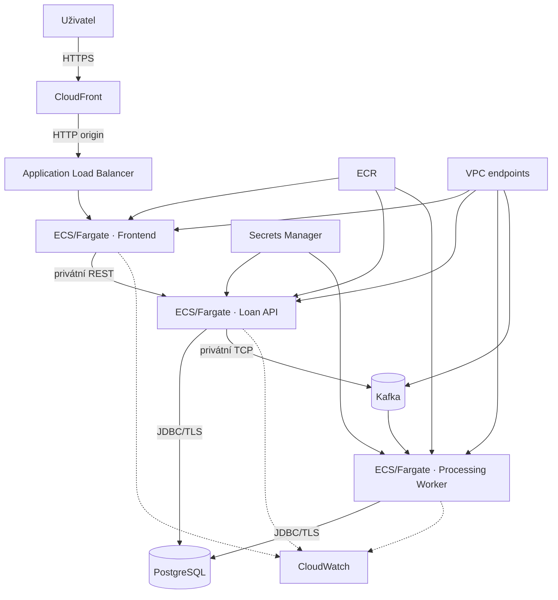

# AWS architektura

Dokument popisuje cílovou cloudovou topologii a dvě úrovně provozu. Bezpečnostní pravidla rozvádí [bezpečnostní model](aws-security.md); release a provozní lifecycle řeší [plán deploymentu](aws-deployment-plan.md).

## Společný model

Existující kontejnery se nasazují bez změny aplikačních rolí:

- ECR uchovává samostatný frontendový a backendový image;
- ECS/Fargate provozuje služby `frontend`, `loan-api` a `processing-worker`;
- CloudFront poskytuje veřejný HTTPS endpoint na výchozí doméně AWS a směruje provoz na Application Load Balancer;
- Application Load Balancer zpřístupňuje pouze frontend;
- Nginx směruje `/api` na privátní Loan API;
- API a worker používají společný PostgreSQL cluster a Kafka-compatible broker;
- CloudWatch centralizuje strukturované logy, metriky a alarmy;
- Secrets Manager poskytuje aplikační přihlašovací údaje za běhu.
- Interface VPC endpoints zpřístupňují ECR, CloudWatch Logs a Secrets Manager bez NAT Gateway; S3 gateway endpoint zajišťuje stažení image layers.

ECS tasky běží v privátních subnetech bez veřejných IP adres. CloudFront je preferovaný veřejný vstup; databáze, broker, API a worker přijímají provoz pouze z odpovídajících security groups. ALB zůstává veřejně dosažitelným HTTP originem, což je explicitní kompromis varianty bez vlastní domény.

## Varianta A — ukázkové prostředí

Krátkodobá varianta zachovává plný aplikační a event-driven tok při kontrolovaných nákladech:

- jeden task pro každou aplikační službu;
- RDS for PostgreSQL v šifrované Single-AZ konfiguraci s automatickými zálohami;
- jeden Kafka broker v KRaft režimu na Fargate s ephemeral storage a privátním DNS;
- dvě Availability Zones pro ALB, aplikační subnety a plánování tasků;
- krátká retence logů, malé horní limity škálování a povinné datum ukončení prostředí.

Single-AZ databáze a jednouzlový broker neposkytují vysokou dostupnost. Nahrazení Kafka tasku odstraní lokální broker data. Varianta je určená výhradně pro fiktivní data a nemá produkční SLA.

CloudFront poskytuje TLS na výchozí doméně AWS a přesměruje HTTP na HTTPS. Výchozí certifikát neumožňuje nastavit vlastní minimální TLS policy. Spojení CloudFront → ALB zůstává HTTP a přímý origin není uzamčený pouze na CloudFront. Produkční varianta používá vlastní doménu, ACM certifikát s řízenou TLS policy, HTTPS také k originu a omezení přístupu k ALB.

## Varianta B — produkční prostředí

Trvalý provoz nahrazuje úsporné kompromisy spravovanou datovou vrstvou a redundancí:

- více tasků každé aplikační služby napříč nejméně dvěma Availability Zones;
- RDS for PostgreSQL Multi-AZ se šifrováním, automatickými zálohami, deletion protection a vyhodnoceným použitím RDS Proxy;
- MSK Provisioned s nejméně třemi brokery napříč AZ; MSK Serverless je alternativou až po kapacitním a nákladovém posouzení;
- interní service discovery nebo interní ALB pro Loan API;
- WAF před veřejným ALB, řízené KMS klíče a oddělená prostředí;
- target tracking autoscaling a deployment circuit breaker pro aplikační služby.

## Srovnání variant

| Oblast | Ukázkové prostředí | Produkční prostředí |
|---|---|---|
| Aplikační compute | 1 Fargate task na roli | více tasků napříč AZ |
| PostgreSQL | RDS Single-AZ | RDS Multi-AZ |
| Kafka | jeden broker na Fargate | Amazon MSK |
| Dostupnost | bez SLA | redundance a řízená obnova |
| Data | pouze fiktivní | po dokončení security a compliance kontrol |
| Provoz | časově omezený | trvalý, monitorovaný |

Pro krátkodobé ukázkové nasazení je přiměřená varianta A. Varianta B je výchozím modelem pro trvalý provoz a práci s reálnými daty.
