# Plán AWS deploymentu

Tento dokument vlastní release, odstranění a kontrolní lifecycle krátkodobého prostředí. Topologii popisuje [AWS architektura](aws-architecture.md) a oprávnění [bezpečnostní návrh](aws-security.md).

## Dva stacky, jeden řízený proces

První spuštění nelze bezpečně řešit jediným stackem: ECS může odkazovat na image až poté, co existují ECR repositories a image v nich. Lifecycle je proto rozdělený, wrapper však zachovává jeden příkaz pro nasazení i odstranění:

1. `DevBankDemo-Images-eu-central-1` vytvoří tři ECR repositories.
2. Wrapper sestaví backend a frontend z existujících Dockerfile, označí je immutable Git SHA a nahraje je do ECR. Kontrolovaný `apache/kafka-native:3.8.0` zrcadlí do privátního repository.
3. `DevBankDemo-eu-central-1` vytvoří síť, RDS, ECS služby, ALB, service discovery, secret a log groups s odkazy pouze na existující image.

Odstranění probíhá opačně. Standardní bootstrap stack `CDKToolkit` není součástí aplikačního lifecycle a skripty jej nikdy nemažou.

```mermaid
flowchart LR
    PRE["Ověření účtu, regionu a čistého commitu"] --> SYNTH["Build, test, CDK synth a diff"]
    SYNTH --> CONFIRM["Explicitní potvrzení"]
    CONFIRM --> ECR["Images stack: ECR repositories"]
    ECR --> PUSH["Build a push image s immutable tagy"]
    PUSH --> APP["Application stack: RDS, ECS, ALB a observabilita"]
    APP --> DEMO["DevBank demo"]
    DEMO --> DESTROY["Application stack → Images stack"]
    DESTROY --> AUDIT["Audit zbytkových resources; CDKToolkit zůstává"]
```



## Příkazy

AWS operace jsou záměrně dostupné pouze přes skripty s očekávaným dvanáctimístným account ID:

```powershell
$env:DEVBANK_AWS_ACCOUNT_ID = "123456789012"
npm run aws:status
npm run aws:deploy
npm run aws:destroy
npm run aws:audit
```

`aws:deploy` před změnou ověří identitu a region `eu-central-1`, připravený `CDKToolkit`, čistý Git commit, lokální build/test/synth a `cdk diff`. Pokračuje pouze po zadání `DEPLOY DEVBANK DEMO`. Skript nikdy nespouští bootstrap.

`aws:destroy` vypíše fyzické resources obou přesně pojmenovaných stacků a pokračuje pouze po zadání `DESTROY DEVBANK DEMO`. Odstraní aplikační stack, následně images stack a spustí audit. Nepoužívá `--all` ani wildcard.

`aws:audit` kontroluje CloudFormation stacky, ECS služby a tasky, RDS, ALB, ECR, Secrets Manager, CloudWatch log groups, VPC a endpoints. Nalezené zbytky vracejí nenulový exit code; stav `CDKToolkit` je pouze informativní.

## Resources spravované CDK

| Stack | Resources |
|---|---|
| Images | 3 ECR repositories: `devbank/backend`, `devbank/frontend`, `devbank/kafka`; immutable tags, scan-on-push, limit deseti image, automatické vyprázdnění při odstranění |
| Application | VPC, 2 veřejné a 2 izolované subnety, Internet Gateway pro ALB, route tables, 4 interface endpoints a S3 gateway endpoint |
| Application | 6 security groups; RDS PostgreSQL 17 Single-AZ; DB subnet group; generovaný Secrets Manager secret |
| Application | ECS cluster, 4 task definitions a služby: frontend, Loan API, Processing Worker a single-broker Kafka |
| Application | private service discovery, veřejný HTTP ALB, target group a 5 CloudWatch log groups s retencí 7 dnů |
| Application | minimální runtime/execution IAM role a standardní CDK custom resource pro restrikci default security group |

Skeleton nevytváří NAT Gateway, EFS, MSK, autoscaling, Multi-AZ RDS, DNS, certifikát ani zdroje mimo oba stacky. Veřejný HTTP listener je vědomý kompromis krátkodobé varianty bez externě spravovaného DNS/certifikátu. Pro reálný provoz je povinný HTTPS endpoint s ACM a DNS.

## Destrukční politika demo varianty

- RDS: `deletionProtection: false`, `RemovalPolicy.DESTROY`, bez finálního snapshotu a s odstraněním automatických záloh.
- ECR: `emptyOnDelete: true`, `RemovalPolicy.DESTROY`.
- Secrets Manager a CloudWatch log groups: `RemovalPolicy.DESTROY`.
- Kafka používá ephemeral storage; prostředí obsahuje výhradně fiktivní data.
- Guardrail test kontroluje, že demo datové resources nemají `Retain` ani `Snapshot`.

## Náklady a provozní rizika

Největší fixní položky tvoří čtyři Fargate tasky, RDS, ALB a interface endpointy účtované v každé AZ. Další náklady vznikají za CloudWatch ingest, ECR storage, Secrets Manager a přenos dat. Cena se musí před deployem ověřit pro `eu-central-1` v AWS Pricing Calculatoru.

Single-AZ RDS, jeden Kafka broker, jeden task na službu, HTTP vstup a absence autoscalingu neposkytují produkční dostupnost ani bezpečnostní profil. Nahrazení Kafka tasku ztrácí broker data; rolling deployment může krátce přerušit službu. Tyto kompromisy drží krátkodobé prostředí s fiktivními daty čitelné a nákladově omezené, nikoli produkční.

Produkční varianta vyžaduje minimálně TLS, autentizaci a autorizaci, WAF, redundantní ECS služby, Multi-AZ RDS, managed Kafka, oddělený migrační task, alarmy, zálohovací/restore testy a schválený disaster-recovery model.

## Lokální kontrola bez AWS

```powershell
cd infra/cdk
npm ci
npm run build
npm test
npm run synth -- --quiet
```

Tyto příkazy pouze sestaví TypeScript, spustí guardrails a vytvoří CloudFormation templates. Nevyžadují credentials a neprovádějí AWS mutace.
